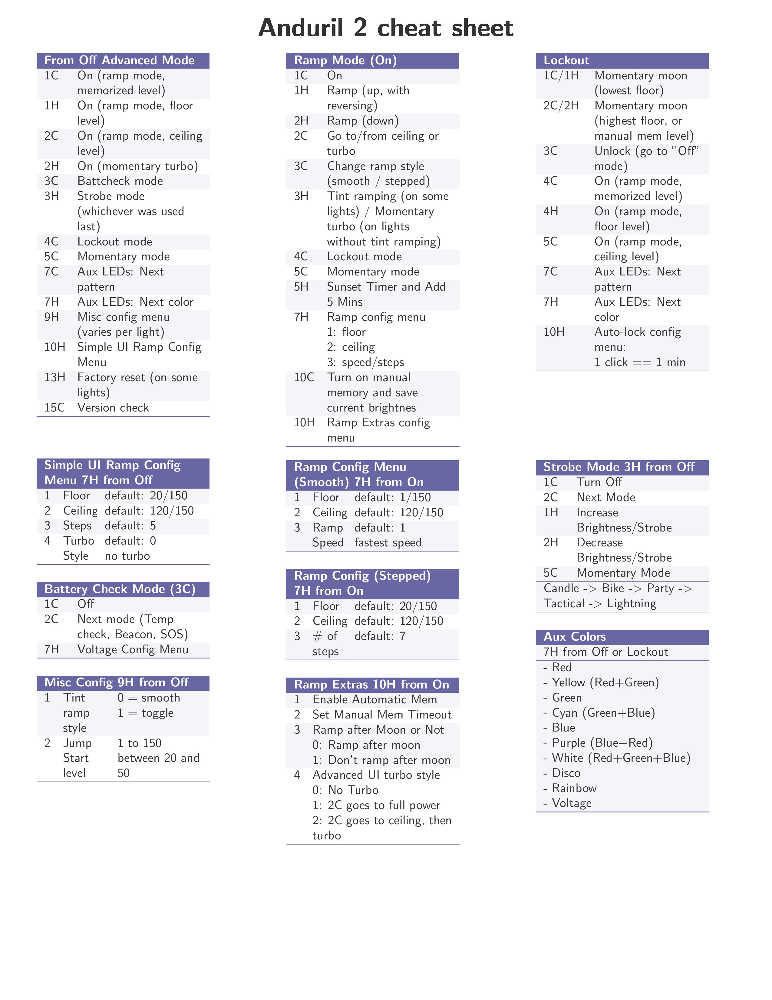

# Anduril 2 Cheat Sheet
Yet Another Anduril 2 Cheat Sheet

## New Light Settings

### auto-calibrate the temperature sensor, do a factory reset.
The process for this is:
  1. Loosen tailcap
  2. Hold button
  3. Tighten tailcap
  4. Keep holding button for about 4s

## Advanced UI
off, 10H

## Ramp config (new)
  1. 1C: On
  2. 3C: Switch to stepped ramp
  3. Hold: Ramp to level 2 of 7
  4. 10C: Activate manual memory and save current brightness
  5. 10H item 2, then 10C: Set hybrid memory timer to 10 minutes
  6. 3C: Switch back to smooth ramp

## enable manual memory (old)
1. ramp light to desired brightness
2. 10c
3. in lock mode 2h will use this level

## Enabled Auto Lockout
1. 4c to lock
2. 10h to configure
  1. wait for blink, then let go
  2. one click per minute (set to 10)

## Check temp calibration
1. 3c to check voltage
2. 2c to check temp
3. 7h to set temp calibration

## Configure Aux lights
1. from off, 7C/7h to configure
2. 4c to lock
3. 7C/7H to configure lock aux

## Tint ramping/Channel switching
1. 9H to configure

# Resources

## Toykeepers setup
https://toykeeper.net/torches/fsm/anduril2/my-setup.txt

